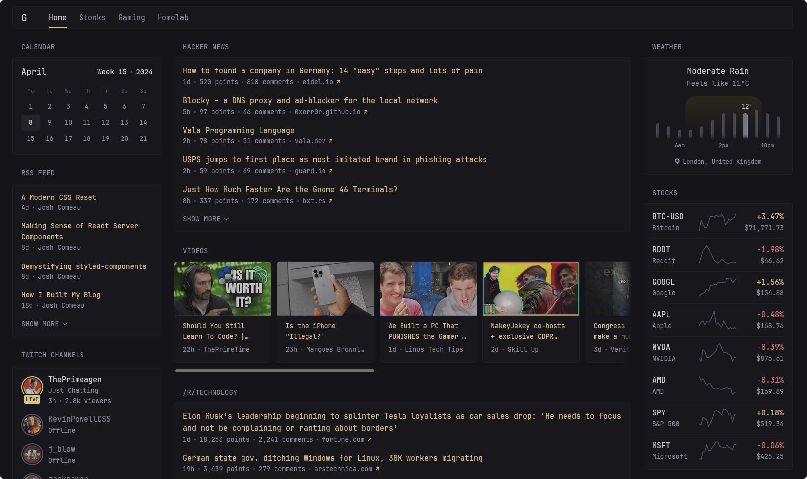

<!--
To README zostało automatycznie wygenerowane przez <https://github.com/YunoHost/apps/tree/master/tools/readme_generator>
Nie powinno być ono edytowane ręcznie.
-->

# Glance dla YunoHost

[](https://ci-apps.yunohost.org/ci/apps/glance/)


[](https://install-app.yunohost.org/?app=glance)

*[Przeczytaj plik README w innym języku.](./ALL_README.md)*

> *Ta aplikacja pozwala na szybką i prostą instalację Glance na serwerze YunoHost.*  
> *Jeżeli nie masz YunoHost zapoznaj się z [poradnikiem](https://yunohost.org/install) instalacji.*

## Przegląd

A self-hosted dashboard that puts all your feeds in one place.

### Various widgets

    RSS feeds
    Subreddit posts
    Weather
    Bookmarks
    Latest YouTube videos from specific channels
    Calendar
    Stocks
    iframe
    Twitch channels & top games
    GitHub releases
    Repository overview
    Site monitor


**Dostarczona wersja:** 0.7.9~ynh1

## Zrzuty ekranu



## Dokumentacja i zasoby

- Oficjalna dokumentacja dla administratora: <https://github.com/glanceapp/glance/blob/main/docs/configuration.md>
- Repozytorium z kodem źródłowym: <https://github.com/glanceapp/glance>
- Sklep YunoHost: <https://apps.yunohost.org/app/glance>
- Zgłaszanie błędów: <https://github.com/YunoHost-Apps/glance_ynh/issues>

## Informacje od twórców

Wyślij swój pull request do [gałęzi `testing`](https://github.com/YunoHost-Apps/glance_ynh/tree/testing).

Aby wypróbować gałąź `testing` postępuj zgodnie z instrukcjami:

```bash
sudo yunohost app install https://github.com/YunoHost-Apps/glance_ynh/tree/testing --debug
lub
sudo yunohost app upgrade glance -u https://github.com/YunoHost-Apps/glance_ynh/tree/testing --debug
```

**Więcej informacji o tworzeniu paczek aplikacji:** <https://yunohost.org/packaging_apps>
